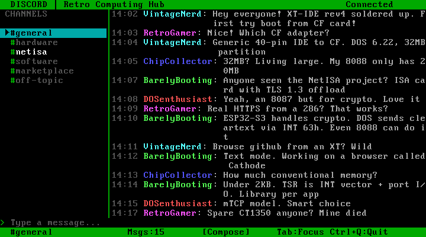
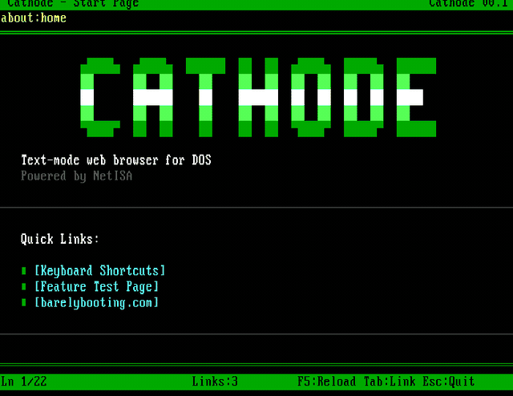
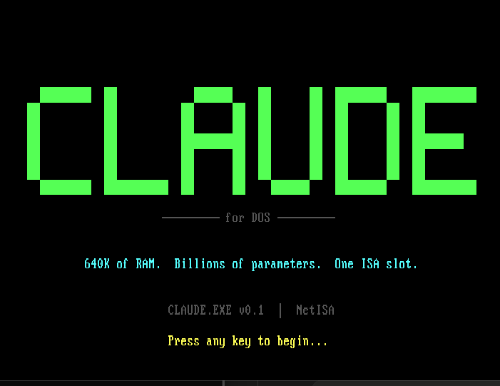
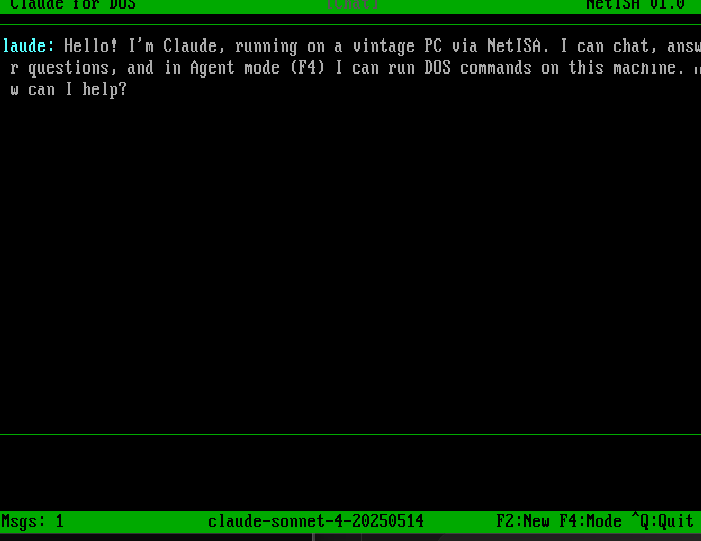
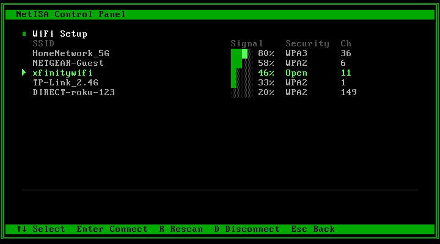
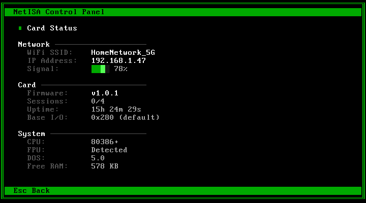

# NetISA

**Bringing TLS 1.3 and the modern internet to vintage ISA PCs.**

> **[barelybooting.com](https://barelybooting.com/)** &mdash; project page, build log, screenshots
> &nbsp;&bull;&nbsp; [YouTube: @BarelyBooting](https://www.youtube.com/@BarelyBooting) &mdash; build videos
> &nbsp;&bull;&nbsp; [Build log + RSS](https://barelybooting.com/log.html)

NetISA is an open-source 8/16-bit ISA expansion card that gives IBM PC/XT/AT and 386/486 systems a first-class path to the modern internet. A Microchip ATF1508AS CPLD handles ISA bus timing deterministically; an Espressif ESP32-S3 handles WiFi, TLS 1.3, and the full TCP/IP stack using hardware-accelerated AES, SHA, RSA, and ECC. The host PC sees a register-mapped coprocessor and talks to it through a small DOS TSR — no proxy box, no serial bottleneck, no software crypto on the retro CPU.

## Screenshots

| | |
|---|---|
|  |  |
| Discord client for DOS | Cathode v0.2 web browser (sort of) |
|  |  |
| Claude for DOS — splash screen | Claude for DOS — chat interface |
|  |  |
| WiFi network scanner | Card status and diagnostics |

## What this unlocks

A retro PC with a NetISA card can, without a modern computer babysitting it:

- **Browse the modern HTTPS web** from Cathode (our built-in text-mode browser), Lynx, Links, or Arachne — real TLS 1.3 sites including Wikipedia, GitHub, and news sites.
- **`git clone` over HTTPS** on a 486 against GitHub or any modern git host.
- **Read Gmail / Outlook / Fastmail** from Pine, Pegasus, or mTCP mail clients (IMAPS, SMTPS).
- **Post to Discord, Mastodon, Bluesky, Matrix, or IRC-over-TLS** (Libera.Chat and friends) via REST APIs or IRCS.
- **Sync files to Dropbox, OneDrive, or Nextcloud** via WebDAV-over-HTTPS.
- **Publish MQTT-over-TLS** to smart home brokers from an 8088.
- **Fetch software and packages** from modern HTTPS-only archives with integrity checking.

What NetISA does **not** unlock: modern graphical web browsing (CPU-bound regardless of transport), streaming video, or anything that requires modern client compute. TLS was never the bottleneck for those.

## How this differs from existing solutions

- **Serial WiFi modems** (WiFi232, RetroWiFi, zimodem) already do TLS offload, but over RS-232 — throughput tops out around 11–20 KB/s, one socket at a time, with AT-command latency on every operation. NetISA is register-mapped on the ISA bus itself, supports multiple concurrent sessions, and doesn't tie up a COM port.
- **stunnel / HTTPS proxies** work, but require a second modern machine running alongside the retro PC. NetISA removes that dependency.
- **ESP32-based NE2000 emulators** put networking on ISA, but the retro CPU still has to run TLS in software — impractical on anything below a fast 486. NetISA offloads the crypto to dedicated silicon.

The specific thing that is new: an open-source, register-mapped ISA coprocessor that terminates TLS 1.3 in hardware-accelerated silicon, with deterministic bus timing on a CPLD so the crypto engine never fights the bus cycle.

## Status

**Phase 0:** Parts ordered, awaiting hardware. All build artifacts ready to flash.
**Phase 1:** DOS software stack and v1 firmware complete. Tested in DOSBox-X.

### What's built

| Component | Status | Quality Gate | Description |
|-----------|--------|-------------|-------------|
| Architecture spec | Complete | — | 2,800+ line specification covering hardware, firmware, INT 63h API, security |
| CPLD logic (Verilog) | Complete | 3 rounds | 95/128 macrocells, full 16-bit I/O decode, JEDEC ready to program |
| Verilog testbench | **160/160 passing** | — | Address decode, IOCHRDY, watchdog, IRQ, alias rejection, back-to-back cycles |
| **ESP32-S3 v1 firmware** | **Complete** | **8 rounds** | WiFi, HTTP client, HTML parser, web config, SNTP, DNS, command dispatch |
| DOS TSR (NETISA.COM) | Complete | — | 678 bytes, hooks INT 63h, presence check, stub handlers |
| Screen library | Complete | — | Direct VGA text buffer rendering, CP437 box drawing, shared across all apps |
| INT 63h API (netisa.h) | Complete | — | Full API definition matching spec Section 4, C wrappers with inline INT 63h |
| Stub layer | Complete | — | Fake data for DOSBox-X testing without hardware |
| Launcher (NETISA.EXE) | Complete | — | WiFi setup, card status, system info, full-screen CP437 UI |
| **Cathode browser** | **v0.2** | **5 rounds** | Text-mode web browser (sort of): streaming HTML parser, HTTP/1.0 fetch, UTF-8, find on page, bookmarks, 38.5KB EXE |
| **Discord client** | **v0.1** | **6 rounds** | Text-mode chat: channels, messages, compose, timed fake messages |
| **Claude client** | **v0.1** | **2 rounds** | Claude AI chat with 3-mode agent system (Chat/Ask/Auto), command execution |
| DOS loopback test | Complete | — | 256-byte bus validation (NISATEST.COM) |

### Next steps

1. Solder breakout boards, wire prototype, walk the 9-gate validation checklist
2. Connect stub layer to real card I/O ports after Phase 0 hardware passes
3. Flash v1 firmware to DevKit, test WiFi + web config via AP mode
4. End-to-end integration: DOS apps talking to real firmware over ISA bus

## v1 Firmware

The v1 firmware replaces the Phase 0 loopback firmware with production networking. It preserves the Phase 0 PSTROBE ISR and register file architecture — the ISA bus interface is unchanged. What changes is what happens after a command arrives via the parallel bus.

### Architecture

- **Core 0:** PSTROBE ISR (highest priority) — handles ISA bus register reads/writes
- **Core 1:** Command handler task, WiFi, HTTP, web config server
- **ISR → Task:** FreeRTOS queue carries `cmd_request_t` (command byte + params)
- **Task → ISR:** Shared volatile `cmd_response` buffer with `__sync_synchronize()` memory barriers

### Modules

| Module | Description |
|--------|-------------|
| `cmd_handler` | Dispatch table maps INT 63h groups 0x00–0x07 to handlers |
| `wifi_mgr` | APSTA mode, auto-connect from NVS, scan, connect/disconnect |
| `http_client` | Up to 4 concurrent TLS sessions via esp_http_client + cert bundle |
| `html_parser` | HTML state machine → CP437 cell stream for Cathode browser |
| `web_config` | Embedded HTTP server with WiFi setup, OTA update, status API |
| `nv_config` | NVS persistent storage for WiFi credentials and admin key |
| `dns_resolver` | lwIP getaddrinfo wrapper |
| `time_sync` | SNTP synchronization with pool.ntp.org |
| `ws_client` | WebSocket stub (reserved for v2) |

### Security

- **Admin authentication:** NVS-stored admin key protects all destructive web endpoints (`/connect`, `/disconnect`, `/restart`, `/update`, `/set-ota-key`). Read-only endpoints (`/status`, `/scan`) remain public for diagnostics.
- **First-time setup mode:** When no admin key is set, all endpoints are open. Users set a password via the web config UI on first use.
- **OTA firmware updates:** Require admin key + content-length validation. OTA handles are properly aborted on errors. Request bodies are drained on all failure paths.

### Testing on bare DevKit (no ISA card needed)

```bash
cd firmware
idf.py set-target esp32s3
idf.py build
idf.py -p COMx flash monitor
```

Connect to "NetISA-Setup" AP from your phone, browse to 192.168.4.1 for the web config UI.

## Cathode: Text-Mode Web Browser

Cathode is a built-in ANSI text-mode web browser that renders modern HTTPS websites in CP437 on any DOS machine from 8088 to Pentium. The browser is split between DOS and ESP32:

- **DOS side** (built): receives a cell stream, manages scrollback, renders to VGA text buffer, handles keyboard navigation
- **ESP32 side** (built): `html_parser` module fetches URLs over HTTPS, parses HTML, converts to (char, attr) cell stream

Currently runs with stub pages for testing. Key features:
- 200-row scrollback buffer on far heap (~80KB)
- Link navigation via Tab/Shift-Tab with visual highlighting
- URL bar editing (F6)
- Back/forward history (20 entries)
- CP437 box-drawing tables, bullet lists, headings, horizontal rules
- Quality-gated: 5 rounds of adversarial review, all Fatal/Significant bugs fixed

```
CATHODE.EXE                     Start page
CATHODE.EXE about:test          Feature test page
CATHODE.EXE about:help          Keyboard shortcuts
```

## Discord Client

A text-mode Discord client for DOS, demonstrating the NetISA card's ability to connect retro PCs to modern chat platforms. Runs with stub data and timed fake messages for DOSBox-X testing.

Key features:
- 6 channels with per-channel far-heap message storage
- Word-wrapped message rendering with author colors
- Compose bar with cursor editing
- Timed fake message injection (~5 second intervals)
- Tab-cycling focus: Channels → Messages → Compose
- PgUp/PgDn scrolling with scroll position tracking
- Quality-gated: 6 rounds of adversarial review, all Fatal/Significant bugs fixed

```
DISCORD.EXE                     Launches Discord client
```

## Claude for DOS

A text-mode Claude AI chat client that talks to the Anthropic API over TLS 1.3 via the NetISA card. Includes a 3-mode agent system for running DOS commands directly from the conversation. Runs with stub responses for DOSBox-X testing.

Key features:
- Chat mode (conversation only), Ask mode (Claude proposes commands, you confirm), Auto mode (Claude runs commands freely)
- Far-heap message pool for small memory model (30 messages, ~15KB)
- Word-wrapped chat rendering with newline support
- 3-line compose area with cursor editing
- [EXEC] tag parsing for command execution with stdout capture
- Iterative agent loop with 5-deep safety cap (no recursive stack growth)
- Quality-gated: 2 rounds of adversarial review

```
CLAUDE.EXE                      Launches Claude client
```

## Roadmap beyond DOS

v1 ships as a DOS/Windows 3.x peripheral. The firmware and CPLD are deliberately architected so that native drivers for modern retro operating systems can land in future releases **without any hardware changes** — the ISA interface is a mode-agnostic byte shuttle, and new behavior lives entirely in ESP32 firmware and host-OS drivers.

- **v1.0** — MS-DOS / FreeDOS / Windows 3.x, Session Mode: card owns TCP/IP and TLS, host talks at the session level via INT 63h.
- **v2.0** — Windows 95/98/NT and Linux/BSD kernel drivers, **NIC Mode**: card presents as a raw Ethernet adapter, host OS runs its own TCP/IP stack. Enables NDIS miniports for Win9x/NT, `net_device` drivers for Linux, and native drivers for NetBSD and FreeBSD. Legacy Winsock applications (Netscape 4, IE3/4, mIRC, ICQ) gain TLS 1.3 through an optional Winsock LSP that routes port-443/993/465 traffic through the card's session-mode engine.
- **v2.5** — **NIC + kTLS Offload Mode**: Linux kTLS and FreeBSD kTLS integration. Host kernel does TCP/IP and the one-shot TLS handshake in software; the card transparently handles per-packet AES-GCM record framing on established sessions. This is the same architecture Mellanox ConnectX, Chelsio T6, and Intel E810 use for kTLS-capable datacenter NICs — brought to a 486.

The three driver modes are specified in [docs/netisa-architecture-spec.md](docs/netisa-architecture-spec.md) section 2.6.1. v1 firmware already recognizes the `CMD_SET_MODE` opcode so that future host drivers probing for advanced-mode support receive a clean, defined error response rather than silent failure. The register map, CPLD logic, and electrical interface are forward-compatible with all three modes on day one.

## Hardware

- **Bus logic:** Microchip ATF1508AS CPLD (TQFP-100, 128 macrocells, 5V native, 10 ns)
- **MCU:** Espressif ESP32-S3-WROOM-1U-N8R8 (WiFi, hardware AES/SHA/RSA/ECC, 8 MB flash, 8 MB PSRAM)
- **Ethernet:** Wiznet W5500 (v1.5, optional)
- **Antenna:** External U.FL to bracket-mount RP-SMA (required for metal PC cases)

## Software

- **DOS TSR** (NETISA.COM) — 678-byte INT 63h handler, under 2KB resident target
- **Launcher** (NETISA.EXE) — Full-screen card configuration UI
- **Cathode** (CATHODE.EXE) — Text-mode web browser
- **Discord** (DISCORD.EXE) — Text-mode chat client
- **Claude** (CLAUDE.EXE) — Claude AI chat client with agent mode
- **Screen library** (screen.h/screen.c) — Shared VGA rendering engine
- **INT 63h API** (netisa.h) — C wrappers for all API groups (0x00-0x07)
- **Stub layer** (netisa_stub.c) — Fake data for DOSBox-X testing
- **v1 Firmware** — ESP32-S3 production firmware (WiFi, HTTP, HTML parser, web config, SNTP, DNS)

All DOS code targets 8088 real mode, compiled with OpenWatcom 2.0.
ESP32 firmware builds with ESP-IDF v5.5.4.

## Repository Structure

```
docs/
  netisa-architecture-spec.md      Full architecture specification (2,800+ lines)

firmware/                          v1 ESP32-S3 production firmware
  CMakeLists.txt                   ESP-IDF project file
  sdkconfig.defaults               ESP-IDF configuration
  partitions.csv                   Dual OTA partition table
  main/
    main.c                         App entry, PSTROBE ISR (preserved from Phase 0)
    cmd_handler.c, cmd_handler.h   Command dispatch (INT 63h groups 0x00-0x07)
    wifi_mgr.c, wifi_mgr.h         WiFi station + AP mode manager
    http_client.c, http_client.h   HTTPS client (4 concurrent TLS sessions)
    html_parser.c, html_parser.h   HTML to CP437 cell stream (for Cathode)
    web_config.c, web_config.h     Web config UI + OTA update server
    nv_config.c, nv_config.h       NVS persistent config storage
    dns_resolver.c, dns_resolver.h DNS resolution wrapper
    time_sync.c, time_sync.h       SNTP time synchronization
    ws_client.c, ws_client.h       WebSocket stub (v2 reserved)
    status.h                       Error codes matching DOS netisa.h

dos/
  lib/
    screen.h, screen.c             VGA text buffer rendering library
    netisa.h, netisa.c             INT 63h API definition and C wrappers
    netisa_stub.c                  Stub implementation for testing
  tsr/
    netisa_tsr.asm                 TSR skeleton (NASM, INT 63h handler)
  launcher/
    main.c, menu.c, wifi.c,       NETISA.EXE launcher application
    status.c, menu.h
  cathode/
    main.c                         Cathode browser entry point
    browser.c, browser.h           Navigation state machine, history
    render.c, render.h             Page renderer (cells to VGA)
    page.c, page.h                 Page buffer (far heap, 200 rows)
    input.c, input.h               Keyboard handler
    urlbar.c, urlbar.h             URL bar editor
    stub_pages.c, stub_pages.h     Hardcoded test pages
  discord/
    main.c                         Discord client entry point
    discord.c, discord.h           State machine, channel switching
    render_dc.c                    Message renderer with word wrap
    input_dc.c                     Keyboard handler, focus cycling
    stub_discord.c                 Fake channels, messages, timed injection
  claude/
    main.c                         Claude client entry point
    claude.h                       Types, constants, prototypes
    claude.c                       Chat state machine, agent mode, key dispatch
    chat.c                         Chat history renderer with word wrap
    compose.c                      3-line compose area with cursor editing
    agent.c                        [EXEC] tag parser, command execution
    stub_claude.c                  Keyword-based stub responses with delay
  Makefile                         Builds all DOS software

phase0/
  cpld/
    netisa.v                       Verilog source (Quartus II, recommended)
    netisa_tb.v                    Verilog testbench (160 tests)
    netisa.pld                     CUPL source (DEPRECATED, historical reference)
  firmware/
    main/main.c                    ESP32-S3 Phase 0 loopback firmware
  dos/
    nisatest.asm                   DOS loopback test (NASM)
  WIRING.md                        Signal-by-signal wiring guide
  BRINGUP.md                       Bring-up playbook with logic analyzer captures
  BUILDLOG.md                      Build log and toolchain notes
  README.md                        Phase 0 overview and validation checklist

hardware/
  kicad/NetISA_RevA/               KiCad schematic and PCB layout

Makefile                           Top-level build: make dos, make sim, make test
```

## Building

### Prerequisites

- **OpenWatcom 2.0** (C:\WATCOM) — DOS C compiler
- **NASM** — Netwide Assembler for TSR and test programs
- **Icarus Verilog** (iverilog) — for running the testbench
- **DOSBox-X** — for testing DOS software
- **ESP-IDF v5.5.4** — for building ESP32-S3 firmware

### Build targets

```bash
# DOS software
make all          # Build everything (DOS software + loopback test)
make dos          # Build TSR, launcher, Cathode, and Discord
make tsr          # Build NETISA.COM only
make launcher     # Build NETISA.EXE only
make cathode      # Build CATHODE.EXE only
make discord      # Build DISCORD.EXE only
make claude       # Build CLAUDE.EXE only
make test         # Build phase0/dos/nisatest.com
make sim          # Run iverilog testbench (160 tests)

# ESP32-S3 firmware
cd firmware
idf.py set-target esp32s3
idf.py build
idf.py -p COMx flash monitor
```

### Testing in DOSBox-X

```
MOUNT C C:\Development\NetISA
C:
CD DOS
NETISA.COM              (loads TSR, prints banner)
NETISA.COM              (prints "already resident")
NETISA.EXE              (launches card control panel)
cathode\CATHODE.EXE     (launches text-mode browser)
discord\DISCORD.EXE     (launches Discord client)
claude\CLAUDE.EXE       (launches Claude AI client)
```

### Automated testing with the development relay

The `devenv/` directory contains a DOSBox-X relay that lets you compile, run, and test DOS programs from the Windows command line or Claude Code:

```bash
# Run a DOS command and capture output
python devenv\dosrun.py "VER"
python devenv\dosrun.py "DIR C:\" "ECHO Hello"

# Assemble and run a test program
python devenv\dosbuild.py --asm phase0\dos\nisatest.asm --run NISATEST.COM

# Run Cathode's HTML parser test suite (11 fixtures, 12 tests)
python devenv\dosrun.py --timeout 120 --cwd \dos "RUNTESTS.EXE"
```

See `devenv/README.md` for full usage and architecture.

See [Phase 0 README](phase0/README.md) for hardware build instructions and wiring guide.

## Community

- **[barelybooting.com](https://barelybooting.com/)** — project page with specs, screenshots, and build log
- **[YouTube: @BarelyBooting](https://www.youtube.com/@BarelyBooting)** — build videos and progress updates
- **[GitHub Discussions](https://github.com/tonyuatkins-afk/NetISA/discussions)** — questions, ideas, feedback
- **[Build log (RSS)](https://barelybooting.com/feed.xml)** — subscribe for milestone updates
- **[r/retrobattlestations](https://www.reddit.com/r/retrobattlestations/)** — project posts and discussion
- **[VOGONS](https://www.vogons.org/)** — vintage computing forum
- **[Hackaday](https://hackaday.io/)** — project logs

## License

MIT (software) / CERN-OHL-P (hardware). See [LICENSE](LICENSE).

## Author

Tony Atkins ([@tonyuatkins-afk](https://github.com/tonyuatkins-afk)) — [barelybooting.com](https://barelybooting.com/about.html)
