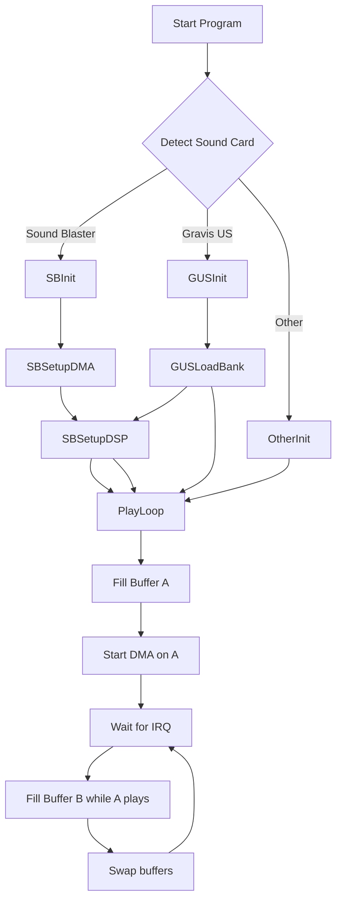

# Executive Summary  
Building a robust DOS-era audio player requires intimate knowledge of 1990s PC sound hardware and their driver interfaces. Unlike modern OSes, DOS audio involved direct port I/O, DMA programming, interrupt handling, and often writing TSRs or using DOS extenders (DPMI/VCPI) to access high memory. Key hardware targets include the Creative **Sound Blaster** family (CT1350 DSP in SB16 and earlier 8‑bit SB/Pro cards), the **Gravis UltraSound** (GUS) sample-based card, Yamaha FM synth chips (OPL2/OPL3 on AdLib/SB), the **Roland MPU-401** MIDI interface (for MT-32/Sound Canvas), and others like the Windows Sound System. Each has unique registers, IRQ/DMA requirements and quirks.  

Best practices include using IRQ-driven double-buffered DMA for smooth playback, carefully programming DMA controllers and DSP commands (e.g. Sound Blaster’s 0x10–0x1F DSP command set)【6†L46-L54】【6†L70-L75】, and respecting required timing (e.g. reading DSP status for handshake or delays when writing FM registers【21†L41-L49】). Mixers and high-voice playback must be done in software (except on GUS which does hardware mixing of its 32 channels). MIDI output on SB16 should use its MPU-401 (UART) mode for independent IRQ/status handling【29†L2711-L2713】. Common pitfalls include IRQ/DMA conflicts (e.g. SB DSP uses the same IRQ and DMA channel pairs), limited addressable DMA memory (low 1MB in real mode), and shared interrupts (8-bit audio and SB-MIDI share INT on SB16 unless MPU mode is used).  

We provide a detailed best-practices guide with code sketches for port sequences, a compatibility matrix of cards/features, example architecture diagrams (mermaid), links to sample code, and a testing checklist. This report assumes DOS 5–7 on 386–Pentium, with or without DOS extenders, and covers low-level programming (real or protected mode) for maximum compatibility.  

## Hardware and Driver Models  
- **Sound Blaster family (CT1350/CT1747 DSP)** – The de facto standard. Earlier SB1/SB2 were 8-bit mono/stereo; SB Pro added stereo 8-bit; SB16 (CT1350) adds 16-bit and OPL3 FM.  These use a DSP chip with I/O ports at e.g. 0x220–0x22F. The DSP is reset by writing 1 then 0 to base+6h and returns 0xAA at the data port【30†L1-L4】 to confirm. Sound Blaster programming uses DSP commands (0x10–0xF7 range) to set up sample rate, start/stop playback, etc. The DSP Write port (e.g. base+0xC) takes commands; before writing, bit7 of the status port (base+0xC) must be 0 (buffer ready)【2†L25-L33】. Mixer registers (base+0x4) set IRQ/DMA/volume【6†L66-L74】. The SB16 added an MPU-401 UART-mode MIDI interface (at base 0x300/0x330), which is preferable because it has its own IRQ/status rather than sharing the SB audio interrupt【29†L2711-L2713】. Sample code (C/ASM) follows patterns like:  
  ```asm
  ; Example: Reset SB DSP at base I/O port DSBX
    mov al, 1
    out dsbx, al        ; DSP reset = 1
    call delay_us(3)
    mov al, 0
    out dsbx, al        ; DSP reset = 0
    ; Poll for 0xAA from (dsbx+0xA) read data port
  ```  
  The DSP *Get Version* command (0xE1) can be sent (after checking write buffer ready) to detect SB presence. Once reset, set the sample rate with command 0x41 (followed by two bytes)【2†L139-L144】, then arm DMA (as below), then send 0x14/0x1C (8-bit single/auto-init) or 0x16/0x1D (16-bit) to begin playback. On 16-bit SB16, use DMA channel 5; on 8-bit cards use channel 1 or 5 (see table below). Auto-init DMA mode is strongly recommended for continuous playback (the DSP will re-trigger interrupts when it finishes a half-buffer)【6†L70-L75】.  

- **AdLib/OPL2 (YM3812) and OPL3** – FM synthesis chips used for midi-like music. Programmed by writing a register number (0x00–0xFF) to the OPL *Address* port (typically 0x388 for AdLib/SB), then writing the data to the OPL *Data* port (0x389)【21†L41-L49】. After each write to address or data port, wait ~3.3µs or ~23µs respectively (read the status port 6 or 35 times as a quick hack)【21†L41-L49】. A typical sequence:  
  ```c
  outp(0x388, reg);       // Set register address
  delay_opl_address();    // ~3µs delay (or poll 6 reads)
  outp(0x389, value);     // Write register data
  delay_opl_data();       // ~23µs delay (or poll 35 reads)
  ```  
  The AdLib (OPL2) has 244 registers for operators, channels, rhythms, etc.【21†L57-L65】. Sound Blaster 16’s OPL3 is backward-compatible but adds doubled channels and stereo panning registers. For best compatibility, treat OPL3 as two OPL2 halves. Ensure you have a valid OPL reset (eg write 0x01, then data 0x20 to reset) on startup.  

- **Gravis UltraSound (GUS)** – A sample-based ISA card with its own DSP and RAM (256KB–1MB). Unlike SB, the GUS *hardware* will mix up to 32 voices. Programming is done by writing commands to GUS I/O ports (jumpered base usually 0x240–0x27F). To write or read GUS memory: set the address registers then read/write data. For example (Pascal-like)【13†L68-L77】:  
  ```pascal
  Port[Base+$103] := $43;         // Command to set low address
  Portw[Base+$104] := AddrLow;    // Low word of address
  Port[Base+$103] := $44;         // Command to set high address (bank)
  Port[Base+$105] := AddrHigh;    // High byte of address
  Port[Base+$107] := Data;        // Write data to GUS RAM
  ```  
  Detection and setup routines often test read/write patterns in GUS RAM【13†L105-L113】. Once initialized, GUS voices are triggered with commands that point to sample offsets in GUS memory and specify frequency, volume, etc. **PNP vs Legacy**: The original GUS “Classic” had fixed IRQ/DMA, while GUS PnP (later release) used OEM DOS drivers to configure resources. Use the SDK for details. Note: If DMA is used on GUS, it uses the SoundBlaster DSP (SoundBlaster emulation) for playback, so DMA/IRQ rules apply similarly. Many GUS player authors simply load samples into GUS memory and let GUS handle playback, requiring no mixing code on the CPU.

- **Roland MPU-401 / MT-32** – The MPU-401 UART mode is a standard MIDI I/O port (0x300/0x301 or 0x330/0x331) that relays MIDI bytes to an external synthesizer (MT-32, Sound Canvas, etc.). After resetting MPU-401 (send 0xFF to data port and expect 0xFE ack)【27†L132-L140】, send MIDI commands directly (wait for bit6 Ready on status port before each byte). MPU-401 is “dumb” (no timing), so timing must be managed by the program’s own scheduler. On SB16 use MPU mode rather than “SB-MIDI” port (0x220+0x6A) since MPU has its own IRQ and status【29†L2711-L2713】. If using a DOS extender, drivers or interrupt handlers may be needed for real-time midi timing.

- **Windows Sound System (WSS)** – An ISA card by Microsoft, supporting 16-bit PCM and General MIDI. It has its own DSP and DOS driver (wsound.sys), but can be programmed via standard SB-compatible DSP commands in many cases. WSS’s OPL3 and MPU-401 are SB16-compatible. The WSS BIOS int calls (0x4Bxx) exist but typically one would ignore BIOS and do direct I/O like SB16.

- **Other Legacy Devices** – AdLib Gold (OPL3-only ISA cards) behave like SB’s OPL3. Covox/SoundMaster (joystick-port DAC) simply wrote 8-bit samples to 0x201; ignore for serious players. CD-ROM audio and FM synthesizer boards (like FM Perfect from FM Towns) are very niche.  

## Programming Interfaces & Memory  
- **Port I/O**:  Direct writes to hardware ports (e.g. `outp()`, `inport()`) form the core interface. Use `OUT 0x388,reg` for OPL2, `OUT 0x220, cmd` for SB DSP commands, etc. Consult each card’s I/O map (e.g. SB base+0xC, GUS base+0x103/104/105, MPU 0x300/0x301)【6†L46-L54】【13†L68-L77】. Always wait for status bits (DSP write buffer empty, MPU ready, etc.) before I/O, using in-ports as quick delays if needed.

- **IRQ and DMA Setup**:  Program the ISA PIC for the chosen IRQ (typically IRQ5 for SB16) by writing the mixer register 0x80 (base+4) with a mask (e.g. 0x01=IRQ2, 0x02=IRQ5, etc)【6†L88-L92】. For DMA, program the DMA controller: disable channel (`out 0x0A, ch+4`), clear flip-flop, set mode in 0x0B (e.g. 0x48=8-bit single, 0x58=8-bit auto-init on chan1)【6†L102-L111】, send page/addr/count via ports 0x83/0x02/0x03 (for channel 1 example)【6†L107-L116】. The same steps apply for 16-bit DMA (use 0xD4–0xC6 ports for channel 5)【6†L119-L128】【6†L129-L135】. Enable the channel with `out 0x0A,ch` (or `0xD4` for 16-bit). Note: 16-bit mode uses channels 5–7; SoundBlaster conventionally uses channel 1 (8-bit) for 8-bit playback, channel 5 (16-bit) for 16-bit playback. DMA addresses must fit the 24-bit DMA page limitation (i.e. buffer in low 16MB). If using buffers above 1MB, ensure A20 is enabled or use DMA chaining through page registers.  

- **TSRs and Extenders**:  Many DOS game audio engines were resident TSRs (Terminate-and-Stay-Resident) or used DOS extenders (DPMI/VCPI). In protected mode or under a DPMI host, use DOS/32A or CWSDPMI to allow direct hardware I/O (often the extender provides `dpmi_real_task` or emulate IO permissive). For high-performance mixing, switch to a flat memory model (huge pointers) to simplify buffer handling. Use XMS (via Int 0x2F/0x87 or a manager) to allocate large buffers above 1MB; copy chunks into a low-memory “bounce buffer” for DMA. EMS can be used similarly but is more complex. Also consider using a 32-bit DOS extender to use 32-bit instructions if aiming for Pentium optimizations.  

- **Memory Models**:  Under real-mode DOS, code must fit in <1MB if using normal pointers. Large (huge) model can help for code/data >64K. Beware of the 64K segment limit when programming DMA: the data chunk for a single DMA transfer cannot cross a 64K boundary (or the hardware wraps). SB auto-init handles this by repeating, but you may need to chain buffers. Use multiple small blocks or page flipping to work around this.  

- **Timer and PIT**:  Precision timing often uses the Programmable Interval Timer (PIT) or BIOS timer ticks. Set the PIT or use BIOS int 08h hooks to service buffer refills. For example, program PIT channel0 for a rate matching half-buffer period and on interrupt refill the next buffer half, then re-arm DMA. Alternatively poll the SB DSP “IRQ pending” bit (read base+0xE) or use SB’s block-transfer interrupt (command 0x48 to set block size and let DSP auto-ack every block)【2†L145-L154】. 

## Timing, Buffering, and Performance  
- **Interrupts vs Polling**:  IRQ-driven playback is best for efficiency. Always enable the SB or MPU interrupt (the DSP will raise IRQ on buffer end in auto-init mode) and install a small ISR or use BIOS hooks to fill the next buffer half. Polling (spin-waiting on status) is simpler but wastes CPU and can’t cope with multitasking. 

- **Double/Triple Buffering**:  Use at least double buffering (ping-pong): while DMA plays buffer A, fill B in the background, and vice versa. This avoids underflows. On a fast CPU, triple buffering can allow mixing time to catch up. Use non-page-locked buffers; once a buffer half is done, compute/mix next data into it.  

- **DMA Block Sizes and Sample Rates**:  SB16 16-bit DMA max size is 0xFFFF (64KB-1); 8-bit also 64KB. For longer samples, send in chunks (DSP command 0x90 “high speed auto-init” can use 64KB chunks). Typical rates: 11025Hz, 22050Hz, 44100Hz for PCM. SB can do 5k–45k Hz via time constant (8-bit) or direct 16-bit rate (0x41h * 2 bytes)【2†L139-L144】. GUS typically uses 24k–48k in 32kHz base or its own divisor; respect voice pitch words. 16-bit mode should use lower rates on slow CPUs (on 386, > 22kHz mixing two channels may max out CPU). Use 44100/48000Hz primarily on Pentiums or use hardware mixing (like GUS) if multiple sources.

- **Mixing and Resampling**:  To play multiple sounds, mix them in a (typically 16-bit accumulator) buffer, then clip to 8-bit or send as 16-bit. Simple linear mixing (sum samples) with saturation is common. Keep accumulators in 16- or 32-bit to avoid overflow when summing voices. Basic resampling (nearest or linear interpolation) lets you play samples at arbitrary rates: e.g., for a sample rate R and desired out rate Rd, step through the sample buffer by R/Rd increments, interpolating as needed to reduce aliasing. For example, fixed-point 16.16 arithmetic and linear interp give decent quality. Avoid expensive math (e.g. floating-point) in inner loops; use lookup tables or unrolled loops. Consider dithering or noise-shaping if quality matters. GUS hardware mixing bypasses all this (you only program voice frequencies).  

- **Optimizations (386–Pentium)**:  On a 386/486, minimize pipeline stalls and use 32-bit registers carefully. Hand-tuned assembly may be needed for inner loops (mixing), but good compilers (Watcom, Microsoft) can do a decent job with `-O2` and `-Oy` (fastcall/fastcall). Use `rep movsd`/`stosd` for bulk clears. Unroll small loops. On Pentium+, the cycle count for memory vs arithmetic shifts, so test best unrolling. Place the mix routine in a high-memory (HMA or XMS) if it speeds up cache (optional). Disable interrupts around critical DMA setup (briefly) to avoid timing issues.  

## MIDI and FM Music  
- **FM (OPL2/OPL3)**:  Music modules intended for AdLib/SBFM use OPL registers. Common trackers (e.g. MOD players) do not use FM; FM was mainly for MIDI. Ensure correct FM chip detection (write/read status 0x388) and initialization (reset OPL, set wave select if needed). Use YM3812/OPL2 Application Manual routines【21†L41-L49】. For SB16 OPL3, you can use extended registers (via register 0x105) to access both chips in stereo mode.  

- **MIDI (General MIDI on MT-32/SB and module playback)**:  Many games output General MIDI or MT-32 SysEx via MPU-401 or SB-MIDI. For MPU-401 UART (recommended on SB16), do:  
  ```asm
  ; Reset MPU-401
  mov dx,MPU_BASE
  inc dx         ; status port
  in al,dx       ; wait until ready (bit6=0)
  dec dx         ; data port (0x300)
  mov al,0xFF
  out dx,al      ; reset command
  inc dx         ; status port
  in al,dx       ; read ack 0xFE
  ```  
  The SB manual shows exactly this sequence【27†L132-L140】. After that, schedule MIDI bytes: poll bit6 of status port (3x1h) and when 0, output byte to base (3x0h). Use a timer or delay to pace events, or hook IRQ if in UART mode (SB16 can IRQ on MIDI TX ready).  

- **File Formats**:  Support common formats: WAV (PCM RIFF, 8/16-bit, little-endian) and Creative VOC (older SB format) for samples; MOD/S3M/XM/etc for tracker music (the code must implement pattern interpretation and mixing); and Standard MIDI Files (.MID) for sequence data (output to FM or MIDI device). Use existing libraries or code. For example, convert WAV by reading header and sending PCM to SB DSP. For VOC, parse block headers (Creative ADPCM or PCM) and feed data via DSP 0x10/0x14. For MOD/S3M/XM, use a documented module format spec (many available online).  

## Compatibility Pitfalls & Matrix  
Below is a summary of common cards, features, interfaces, and gotchas:

| Card/Device         | Digital Audio  | FM Synth  | MIDI (Intf)         | IRQ/DMA (typical)       | Common Issues/Pitfalls                           |
|---------------------|----------------|-----------|---------------------|-------------------------|--------------------------------------------------|
| **AdLib**           | –              | OPL2 (mono)  | –                   | IRQ2 or 5 (for timers)   | No DMA, only FM; relies on timers; 3.3µs/23µs delays required【21†L41-L49】.             |
| **Sound Blaster 1.x/2.0** | 8-bit PCM (mono for SB1, stereo for SB2) | OPL2 (SB2 has dual OPL in stereo) | SB-MIDI (UART via DSP)  | DMA1 (8-bit), IRQ5 usually | Early SB1 had no auto-init DMA (polling only). SB2.0 had optional CMS (PWM) chip. Many games assume base=0x220. DSP command set v1/v2.                           |
| **Sound Blaster Pro**   | 8-bit PCM (stereo)   | OPL2 (stereo) | SB-MIDI (UART)      | DMA1 (8-bit), IRQ5      | More DMA modes; DSP v2.x. Mixer and new commands (e.g. 0xD0 stop, 0xD1 on) exist. Beware SB-compatible clones that differ.  |
| **Sound Blaster 16**    | 8/16-bit PCM (stereo), ADPCM  | OPL3 (stereo) | MPU-401 UART (2x ports)【29†L2711-L2713】 | DMA1 (8-bit), DMA5 (16-bit), IRQ5 | MPU-401 preferred for MIDI (separate INT)【29†L2711-L2713】. DSP v4.x with high-speed 44k support. Must use 32-bit linear addressing for >64KB blocks (cmd 0x48). SB16 PnP often at 0x220, IRQ7/10 possible. |
| **AdLib Gold/OPL3 Boards** | –  | OPL3 (stereo) | –  | IRQ5 (timer)   | Similar to SB16 FM section but no DSP; no PCM output. Programming registers identical to OPL3. |
| **Gravis UltraSound**  | Multi-voice PCM (mono, 32 channels) | – | MPU-401 clone (some) | SB-compatible emulation: DMA1/5, IRQ5 | GUS takes over SB DSP: must install SB DSP emulation for digital audio. If playing through GUS, do *not* also program SB DMA on same channels. GUS RAM is slow to program from protected mode without page locking. PnP drivers needed for IRQ/DMA detection (check /GUSPnp utility).                 |
| **Windows Sound System (WSS)** | 8/16-bit PCM (stereo) | OPL3 | MPU-401 + GM | DMA1/5, IRQ5 | Functions like SB16. However, WSS also includes CD-ROM/IDE. WSS is less common under DOS; use SB compatibility mode if needed. |
| **Roland MT-32 / Sound Canvas** | – | –  | MPU-401 UART     | IRQ5, base 300h/330h | Actual synthesizer module; requires MPU-401 to play MIDI. Ensure to reset MPU-401 to exit UART on exit.                     |

*(IRQs/DMA shown are defaults; user/system settings may differ. Avoid DMA2/3/7 (cascade/invalid) when possible.)*

Common pitfalls and notes: IRQ/DMA conflicts (e.g. EGA video often uses IRQ5, SB conflict; games often allow choosing IRQ/DMA). DMA can only address below 16MB (24-bit), so be careful with buffers above 1MB (set A20). Some motherboards have noisy DMA; use 16-bit DMA to reduce noise. Protected-mode extenders may disable A20 or trap I/O—test hardware access with the extender. BIOS sound interrupts (INT 13h/AX for SB) are often unreliable and should generally be bypassed in favor of direct DSP writes. Finally, DOS memory fragmentation (TSR or driver footprint) can prevent loading large TSR-based players; use Compact drivers or load high (LOADHIGH) to maximize space.  

## Example DOS Audio Player Architectures  

Below are conceptual flow diagrams (mermaid) for typical DOS audio playback loops:



```mermaid
flowchart LR
  subgraph Mixing
    S1[Sample1 (instrument)] --> M1[Resampler & Gain]
    S2[Sample2 (sfx)] --> M1
    M1 --> Sum[16-bit sum + Clamp]
    Sum -->ToBuf[PCM Buffer]
  end
  subgraph I/O
    ToBuf --> DMA[DMA controller] --> SB[DSP]
    SB --> IRQ[Audio IRQ]
    IRQ --> CPU[ISR]
    CPU --> PlayLoop
  end
```

These outline: (a) **Initialization** – detect and init card (reset DSP or OPL chip, set IRQ/DMA), load instruments (GUS sample bank or FM patch tables); (b) **Playback loop** – fill buffer halves in ISR context, program DMA and DSP commands; (c) **Mixing path** – mixing multiple sources into the buffer that DMA will play.

*(Actual implementations may use multiple threads or DPMI callbacks if using an extender, but the core flow is similar.)*

## Sample Code Snippets and References  

- **Sound Blaster 8-bit DMA Setup (C)**:
  ```c
  #define SB_BASE 0x220
  #define DSP_WRITE (SB_BASE+0xC)
  #define DSP_STATUS (SB_BASE+0xC)
  #define DSP_RESET (SB_BASE+0x6)
  void SB_Reset() {
    outportb(DSP_RESET, 1);
    delay_us(3);
    outportb(DSP_RESET, 0);
    // Wait for 0xAA
    while ((inportb(DSP_STATUS)&0x80)==0);
    if (inportb(SB_BASE+0xA)==0xAA) { /* DSP ready */ }
  }
  void SB_SetRate(int rate) {
    outportb(DSP_WRITE, 0x41);
    outportb(DSP_WRITE, (rate>>8)&0xFF);
    outportb(DSP_WRITE, rate&0xFF);
  }
  void SB_PlayDMA(void* buf, unsigned len) {
    // Program DMA (channel 1)
    outportb(0x0A, 0x05); // disable DMA1
    outportb(0x0C, 0);    // reset flip-flop
    outportb(0x0B, 0x48); // auto-init, write, ch1
    unsigned seg = FP_SEG(buf), ofs = FP_OFF(buf);
    outportb(0x83, seg>>8);
    outportb(0x02, ofs&0xFF);
    outportb(0x02, (ofs>>8)&0xFF);
    outportb(0x03, (len-1)&0xFF);
    outportb(0x03, ((len-1)>>8)&0xFF);
    outportb(0x0A, 0x01); // enable DMA1
    // Send DSP command to start playback
    outportb(DSP_WRITE, 0x1C);  // 8-bit auto-init playback
  }
  ```
  This illustrates resetting the DSP, setting sample rate, configuring DMA (auto-init mode), and starting 8-bit audio【6†L102-L111】【30†L1-L4】.

- **OPL2 Register Write (Assembly)**:
  ```asm
    mov dx, 0x388   ; OPL address port
    mov al, regNum
    out dx, al      ; set register
    ; delay ~3.3us, e.g., 6 in-reads from 0x388
    mov cx,6
  wait1: in al,dx
    loop wait1
    inc dx          ; data port 0x389
    mov al, value
    out dx, al
    ; delay ~23us, e.g., 35 in-reads
    mov cx,35
  wait2: in al,dx
    loop wait2
  ```
  Based on the AdLib guide【21†L41-L49】. This writes `value` to OPL register `regNum`.

- **GUS Memory Write (C)**:
  ```c
  #define GUS_BASE 0x240
  void GUS_SetAddress(unsigned long addr) {
    unsigned short low = addr & 0xFFFF;
    unsigned char high = (addr >> 16) & 0xFF;
    outportb(GUS_BASE+0x103, 0x43);
    outportw(GUS_BASE+0x104, low);
    outportb(GUS_BASE+0x103, 0x44);
    outportb(GUS_BASE+0x105, high);
  }
  void GUS_WriteMem(unsigned long addr, unsigned char val) {
    GUS_SetAddress(addr);
    outportb(GUS_BASE+0x107, val);
  }
  // Example: write 0xAA at offset 0 in GUS RAM
  GUS_WriteMem(0, 0xAA);
  unsigned char test = inportb(GUS_BASE+0x107);
  // 'test' should be 0xAA if card present.
  ```
  This is derived from the GUS programming reference【13†L68-L77】【13†L99-L107】. Replace `GUS_BASE` with the actual port (often 0x240 or 0x280 etc.).

For more examples, see open-source DOS audio projects (e.g. DOOM’s SB driver, Allegro 2.x DSP, GUSMOD players). A few sources:

- [DOSBox-X Wiki – Sound Blaster DSP Commands](https://github.com/joncampbell123/dosbox-x/wiki/Hardware:Sound-Blaster:DSP-commands) – lists SB DSP commands and usage.【3†】  
- [Sound Blaster 16 Programming Guide (OSDev)](http://wiki.osdev.org/Sound_Blaster_16) – concise SB init/DMA sequences【6†L46-L54】【6†L70-L75】.  
- [Creative Labs SB16 Manual (Archive.org)](https://archive.org/details/CreativeLabsSoundBlaster16Manual) – official manual with detailed commands.  
- [Gravis Ultrasound Programmer’s Guide (G.U.P.E)](https://archive.org/details/GUSDOC_BasicGravisUltraSoundProgramming) – sample code and addresses【13†】.  
- [YM3812 (OPL2) Programming Manual (Yamaha)](https://archive.org/stream/YamahaYM3812ApplicationManual/Yamaha%20YM3812%20Application%20Manual_djvu.txt) – register details.  
- [Bochs AdLib/SB FM Programming Guide (Jeff Lee)](https://bochs.sourceforge.io/techspec/adlib_sb.txt) – AdLib/SB register reference【21†】.

## Testing and Diagnostics  

- **Sound Card Utilities**:  Use SB diagnostic tests (e.g. `SBSPKR.COM` or `AUDIOBP.EXE` from old SDKs) to verify DMA and IRQ. SB16 has a DOS utility `BLASTER.EXE` to test DSP commands. Gravis had `GUSSETUP` to verify memory and IRQ. Roland’s MIDI monitors (or connect headphones to MPU's passthrough) test MIDI output.  

- **In-Circuit Checks**:  Toggle the speaker line (DSP command 0xD1/0xD3) to confirm output. Write known patterns to a buffer and record (if possible) to verify DMA. Use logic probes or an ISA bus analyzer to trace /IOREQ and DMA lines (if hardware available).  

- **Software Debug**:  Insert loops that poll DSP status for IRQ acknowledgments. Use DOS debug or DDT to step I/O. Under DOS extenders, use real-mode debug stub (DOSBox, v86-mode) to simulate.  

- **Timing Tests**:  Cross-check PIT vs expected rate by toggling a parallel port pin at buffer swap. Log time between IRQs. Watch out for interrupt starvations (e.g. disable Multitasking, TSRs).  

- **Compatibility Checklist**:  
  - Test all target IRQ/DMA configs (e.g. IRQ5/1, IRQ5/5, IRQ7/1, etc.).  
  - Run on both real mode and with a DPMI host (DOSBox, QEMU, real hardware).  
  - Try different memory models (tiny, small, medium, large). Ensure no stack smashing in PMODE.  
  - Use **Turbo Debugger** or **SoftICE** under DOS when in doubt.  

## Conclusion  

Creating a DOS audio player is complex but manageable with careful low-level coding. Follow historical guides and reference manuals for each card, use IRQ-driven DMA with double buffering, and test across multiple hardware setups. Pay special attention to resource conflicts and memory mapping. By combining SB/GUS/FM/MIDI support, your player can cover the full gamut of DOS-era PC audio.  

**Open Questions / Limitations:** This report assumes ISA-era hardware and does not cover modern emulators’ quirks. Some details (e.g. Windows Sound System programming) are beyond scope. The reader should consult card-specific manuals and community resources for exhaustive register lists and edge cases. For very fine audio quality, advanced resampling or dithering techniques (beyond this summary) may be needed.  

**Sources:** Official Sound Blaster manuals and programming guides【1†】【6†】【30†】; Gravis UltraSound programming references【13†】; Yamaha OPL2 documentation【21†】; community wikis and archived docs【6†】【29†】【3†】.